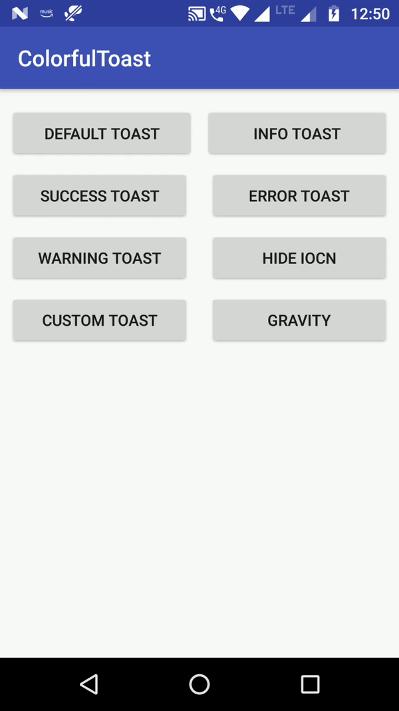

# ColorfulToast
[](https://www.android.com)
[](https://android-arsenal.com/api?level=19)




## Prerequisites

Add it in your root 'build.gradle' at the end of repositories (project level):

```gradle
allprojects {
	repositories {
		...
		maven { url "https://jitpack.io" }
	}
}
```

## Dependency

Add this to your apps's `build.gradle` file:

```gradle
dependencies {
	...
	implementation 'com.github.anil-kumar-singh:ColorfulToast:v1.0'
}
```
## Usage


Default Toast:

``` java
new ColorfulToast.Builder(this)
                        .text("Default Toast")
                        .duration(ColorfulToast.LENGTH_SHORT)
                        .build()
                        .show();
```
Success Toast:

``` java
new ColorfulToast.Builder(this)
                        .text("Success Toast")
                        .duration(ColorfulToast.LENGTH_SHORT)
                        .type(ColorfulToast.TYPE_SUCCESS)
                        .build()
                        .show();
```
Info Toast:

``` java
new ColorfulToast.Builder(this)
                        .text("Info Toast")
                        .duration(ColorfulToast.LENGTH_SHORT)
                        .type(ColorfulToast.TYPE_INFO)
                        .build()
                        .show();
```
Warning Toast:

``` java
new ColorfulToast.Builder(this)
                        .text("Warning Toast")
                        .duration(ColorfulToast.LENGTH_LONG)
                        .type(ColorfulToast.TYPE_WARNING)
                        .build()
                        .show();
```
Error Toast:

``` java
new ColorfulToast.Builder(this)
                        .text("Error Toast")
                        .duration(ColorfulToast.LENGTH_SHORT)
                        .type(ColorfulToast.TYPE_ERROR)
                        .build()
                        .show();
```
Hide Icon:

``` java
new ColorfulToast.Builder(this)
                       .text("Hide Icon")
                       .duration(ColorfulToast.LENGTH_LONG)
                       .type(ColorfulToast.TYPE_WARNING)
                       .hideIcon()
                       .build()
                       .show();
```
Custom Toast

``` java
new ColorfulToast.Builder(this)
                        .text("Custom Toast")
                        .duration(ColorfulToast.LENGTH_LONG)
                        .type(ColorfulToast.TYPE_CUSTOM)
                        .textColor(Color.YELLOW)
                        .backgroundColor(Color.parseColor("#2c387e"))
                        .icon(R.drawable.ic_android_24px)
                        .build()
                        .show();

```


